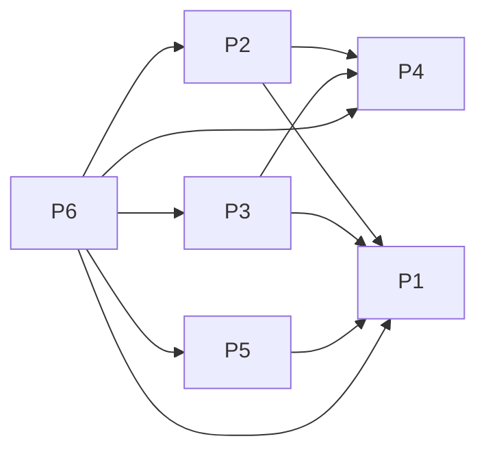

# Projects and dependencies analysis

This document provides a comprehensive overview of the projects and their dependencies in the context of upgrading to .NETCoreApp,Version=v10.0.

## Table of Contents

- [Executive Summary](#executive-Summary)
  - [Highlevel Metrics](#highlevel-metrics)
  - [Projects Compatibility](#projects-compatibility)
  - [Package Compatibility](#package-compatibility)
  - [API Compatibility](#api-compatibility)
- [Aggregate NuGet packages details](#aggregate-nuget-packages-details)
- [Top API Migration Challenges](#top-api-migration-challenges)
  - [Technologies and Features](#technologies-and-features)
  - [Most Frequent API Issues](#most-frequent-api-issues)
- [Projects Relationship Graph](#projects-relationship-graph)
- [Project Details](#project-details)

  - [CatalogAPI/CatalogAPI.csproj](#catalogapicatalogapicsproj)
  - [GrpcShared/GrpcShared.csproj](#grpcsharedgrpcsharedcsproj)
  - [IdentityAPI/IdentityAPI.csproj](#identityapiidentityapicsproj)
  - [OrderingAPI/OrderingAPI.csproj](#orderingapiorderingapicsproj)
  - [Shared/Shared.csproj](#sharedsharedcsproj)
  - [Tests/Tests.csproj](#teststestscsproj)

## Executive Summary

### Highlevel Metrics

| Metric | Count | Status |
| :--- | :---: | :--- |
| Total Projects | 6 | 0 require upgrade |
| Total NuGet Packages | 38 | All compatible |
| Total Code Files | 188 |  |
| Total Code Files with Incidents | 0 |  |
| Total Lines of Code | 9776 |  |
| Total Number of Issues | 0 |  |
| Estimated LOC to modify | 0+ | at least 0.0% of codebase |

### Projects Compatibility

| Project | Target Framework | Difficulty | Package Issues | API Issues | Est. LOC Impact | Description |
| :--- | :---: | :---: | :---: | :---: | :---: | :--- |
| [CatalogAPI/CatalogAPI.csproj](#catalogapicatalogapicsproj) | net10.0 | ✅ None | 0 | 0 |  | AspNetCore, Sdk Style = True |
| [GrpcShared/GrpcShared.csproj](#grpcsharedgrpcsharedcsproj) | net10.0 | ✅ None | 0 | 0 |  | ClassLibrary, Sdk Style = True |
| [IdentityAPI/IdentityAPI.csproj](#identityapiidentityapicsproj) | net10.0 | ✅ None | 0 | 0 |  | AspNetCore, Sdk Style = True |
| [OrderingAPI/OrderingAPI.csproj](#orderingapiorderingapicsproj) | net10.0 | ✅ None | 0 | 0 |  | AspNetCore, Sdk Style = True |
| [Shared/Shared.csproj](#sharedsharedcsproj) | net10.0 | ✅ None | 0 | 0 |  | ClassLibrary, Sdk Style = True |
| [Tests/Tests.csproj](#teststestscsproj) | net10.0 | ✅ None | 0 | 0 |  | DotNetCoreApp, Sdk Style = True |

### Package Compatibility

| Status | Count | Percentage |
| :--- | :---: | :---: |
| ✅ Compatible | 38 | 100.0% |
| ⚠️ Incompatible | 0 | 0.0% |
| 🔄 Upgrade Recommended | 0 | 0.0% |
| ***Total NuGet Packages*** | ***38*** | ***100%*** |

### API Compatibility

| Category | Count | Impact |
| :--- | :---: | :--- |
| 🔴 Binary Incompatible | 0 | High - Require code changes |
| 🟡 Source Incompatible | 0 | Medium - Needs re-compilation and potential conflicting API error fixing |
| 🔵 Behavioral change | 0 | Low - Behavioral changes that may require testing at runtime |
| ✅ Compatible | 0 |  |
| ***Total APIs Analyzed*** | ***0*** |  |

## Aggregate NuGet packages details

| Package | Current Version | Suggested Version | Projects | Description |
| :--- | :---: | :---: | :--- | :--- |
| AspNetCore.Identity.MongoDbCore | 7.0.0 |  | [IdentityAPI.csproj](#identityapiidentityapicsproj) | ✅Compatible |
| FluentValidation | 12.1.0 |  | [CatalogAPI.csproj](#catalogapicatalogapicsproj) [IdentityAPI.csproj](#identityapiidentityapicsproj) [OrderingAPI.csproj](#orderingapiorderingapicsproj) [Shared.csproj](#sharedsharedcsproj) [Tests.csproj](#teststestscsproj) | ✅Compatible |
| FluentValidation.DependencyInjectionExtensions | 12.0.0 |  | [IdentityAPI.csproj](#identityapiidentityapicsproj) | ✅Compatible |
| FluentValidation.DependencyInjectionExtensions | 12.1.0 |  | [CatalogAPI.csproj](#catalogapicatalogapicsproj) [OrderingAPI.csproj](#orderingapiorderingapicsproj) | ✅Compatible |
| Google.Apis.Auth | 1.70.0 |  | [IdentityAPI.csproj](#identityapiidentityapicsproj) | ✅Compatible |
| Google.Protobuf | 3.33.0 |  | [GrpcShared.csproj](#grpcsharedgrpcsharedcsproj) | ✅Compatible |
| Grpc.AspNetCore | 2.67.0 |  | [GrpcShared.csproj](#grpcsharedgrpcsharedcsproj) | ✅Compatible |
| Grpc.AspNetCore | 2.70.0 |  | [CatalogAPI.csproj](#catalogapicatalogapicsproj) [OrderingAPI.csproj](#orderingapiorderingapicsproj) | ✅Compatible |
| Grpc.Core.Api | 2.70.0 |  | [Shared.csproj](#sharedsharedcsproj) | ✅Compatible |
| Grpc.Tools | 2.68.1 |  | [GrpcShared.csproj](#grpcsharedgrpcsharedcsproj) | ✅Compatible |
| HotChocolate.AspNetCore | 15.1.11 |  | [CatalogAPI.csproj](#catalogapicatalogapicsproj) | ✅Compatible |
| Mapster | 7.4.0 |  | [CatalogAPI.csproj](#catalogapicatalogapicsproj) [IdentityAPI.csproj](#identityapiidentityapicsproj) [OrderingAPI.csproj](#orderingapiorderingapicsproj) | ✅Compatible |
| Mapster.Async | 2.0.1 |  | [CatalogAPI.csproj](#catalogapicatalogapicsproj) [IdentityAPI.csproj](#identityapiidentityapicsproj) [OrderingAPI.csproj](#orderingapiorderingapicsproj) | ✅Compatible |
| Mapster.DependencyInjection | 1.0.1 |  | [CatalogAPI.csproj](#catalogapicatalogapicsproj) [IdentityAPI.csproj](#identityapiidentityapicsproj) [OrderingAPI.csproj](#orderingapiorderingapicsproj) | ✅Compatible |
| Mapster.EFCore | 5.1.1 |  | [CatalogAPI.csproj](#catalogapicatalogapicsproj) [OrderingAPI.csproj](#orderingapiorderingapicsproj) | ✅Compatible |
| Mediator.Abstractions | 3.0.* |  | [OrderingAPI.csproj](#orderingapiorderingapicsproj) | ✅Compatible |
| Mediator.Abstractions | 3.0.1 |  | [CatalogAPI.csproj](#catalogapicatalogapicsproj) [IdentityAPI.csproj](#identityapiidentityapicsproj) [Shared.csproj](#sharedsharedcsproj) | ✅Compatible |
| Mediator.SourceGenerator | 3.0.1 |  | [CatalogAPI.csproj](#catalogapicatalogapicsproj) [IdentityAPI.csproj](#identityapiidentityapicsproj) [OrderingAPI.csproj](#orderingapiorderingapicsproj) | ✅Compatible |
| Microsoft.AspNetCore.Authentication.JwtBearer | 9.0.14 |  | [IdentityAPI.csproj](#identityapiidentityapicsproj) [Shared.csproj](#sharedsharedcsproj) | ✅Compatible |
| Microsoft.AspNetCore.OpenApi | 9.0.14 |  | [CatalogAPI.csproj](#catalogapicatalogapicsproj) [IdentityAPI.csproj](#identityapiidentityapicsproj) [OrderingAPI.csproj](#orderingapiorderingapicsproj) | ✅Compatible |
| Microsoft.EntityFrameworkCore | 9.0.14 |  | [CatalogAPI.csproj](#catalogapicatalogapicsproj) [OrderingAPI.csproj](#orderingapiorderingapicsproj) [Shared.csproj](#sharedsharedcsproj) | ✅Compatible |
| Microsoft.EntityFrameworkCore.Design | 9.0.14 |  | [CatalogAPI.csproj](#catalogapicatalogapicsproj) [OrderingAPI.csproj](#orderingapiorderingapicsproj) | ✅Compatible |
| Microsoft.EntityFrameworkCore.InMemory | 9.0.14 |  | [Tests.csproj](#teststestscsproj) | ✅Compatible |
| Microsoft.EntityFrameworkCore.Relational | 9.0.14 |  | [CatalogAPI.csproj](#catalogapicatalogapicsproj) [OrderingAPI.csproj](#orderingapiorderingapicsproj) | ✅Compatible |
| Microsoft.EntityFrameworkCore.SqlServer | 9.0.14 |  | [CatalogAPI.csproj](#catalogapicatalogapicsproj) [OrderingAPI.csproj](#orderingapiorderingapicsproj) | ✅Compatible |
| Microsoft.Extensions.Caching.Hybrid | 9.10.0 |  | [OrderingAPI.csproj](#orderingapiorderingapicsproj) | ✅Compatible |
| Microsoft.Extensions.Caching.StackExchangeRedis | 9.0.14 |  | [CatalogAPI.csproj](#catalogapicatalogapicsproj) [IdentityAPI.csproj](#identityapiidentityapicsproj) [OrderingAPI.csproj](#orderingapiorderingapicsproj) | ✅Compatible |
| Microsoft.NET.Test.Sdk | 17.14.1 |  | [Tests.csproj](#teststestscsproj) | ✅Compatible |
| MongoDB.Driver | 3.5.1 |  | [IdentityAPI.csproj](#identityapiidentityapicsproj) | ✅Compatible |
| Moq | 4.20.72 |  | [Tests.csproj](#teststestscsproj) | ✅Compatible |
| StackExchange.Redis | 2.10.1 |  | [CatalogAPI.csproj](#catalogapicatalogapicsproj) [OrderingAPI.csproj](#orderingapiorderingapicsproj) | ✅Compatible |
| System.IdentityModel.Tokens.Jwt | 8.15.0 |  | [IdentityAPI.csproj](#identityapiidentityapicsproj) | ✅Compatible |
| WolverineFx | 4.12.3 |  | [CatalogAPI.csproj](#catalogapicatalogapicsproj) [OrderingAPI.csproj](#orderingapiorderingapicsproj) [Shared.csproj](#sharedsharedcsproj) | ✅Compatible |
| WolverineFx.EntityFrameworkCore | 4.12.3 |  | [CatalogAPI.csproj](#catalogapicatalogapicsproj) [OrderingAPI.csproj](#orderingapiorderingapicsproj) | ✅Compatible |
| WolverineFx.RabbitMQ | 4.12.3 |  | [CatalogAPI.csproj](#catalogapicatalogapicsproj) [OrderingAPI.csproj](#orderingapiorderingapicsproj) | ✅Compatible |
| WolverineFx.SqlServer | 4.12.3 |  | [CatalogAPI.csproj](#catalogapicatalogapicsproj) [OrderingAPI.csproj](#orderingapiorderingapicsproj) | ✅Compatible |
| xunit | 2.9.3 |  | [Tests.csproj](#teststestscsproj) | ✅Compatible |
| xunit.runner.visualstudio | 3.1.4 |  | [Tests.csproj](#teststestscsproj) | ✅Compatible |

## Top API Migration Challenges

### Technologies and Features

| Technology | Issues | Percentage | Migration Path |
| :--- | :---: | :---: | :--- |

### Most Frequent API Issues

| API | Count | Percentage | Category |
| :--- | :---: | :---: | :--- |

## Projects Relationship Graph

Legend:
📦 SDK-style project
⚙️ Classic project

## Project Details

