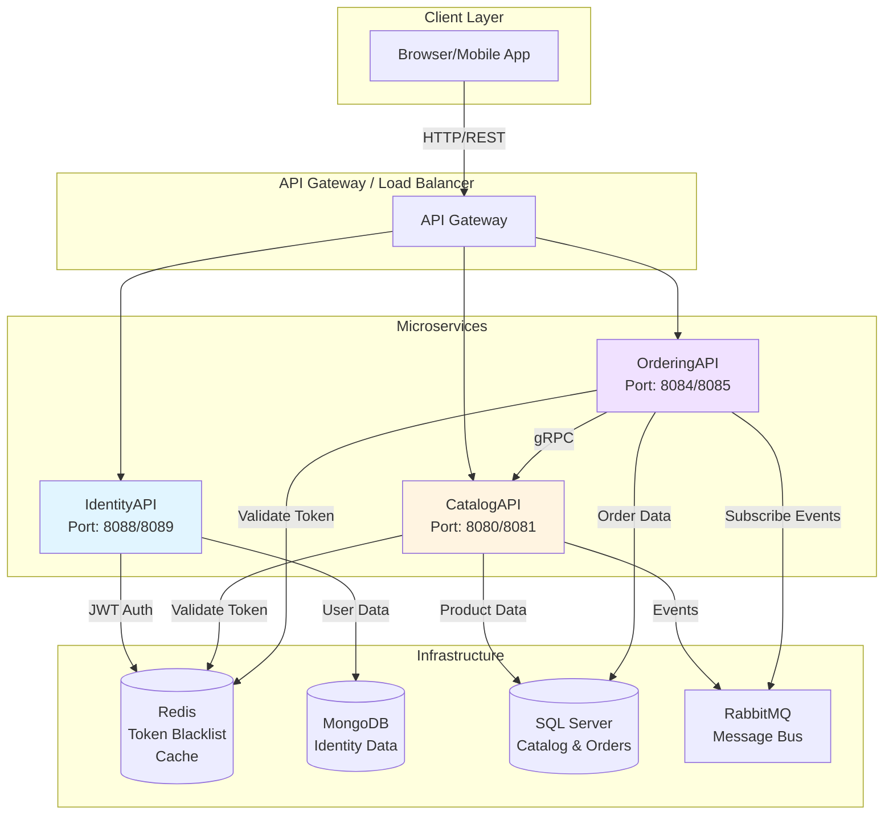
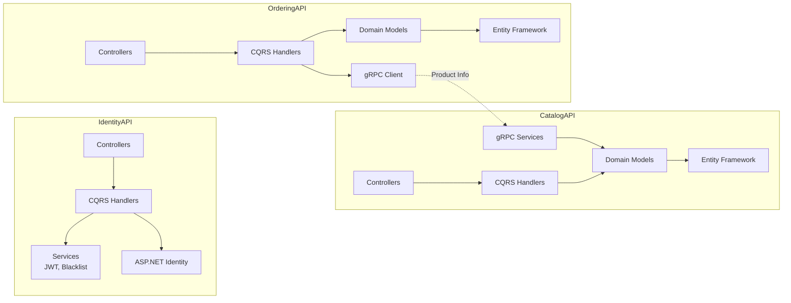
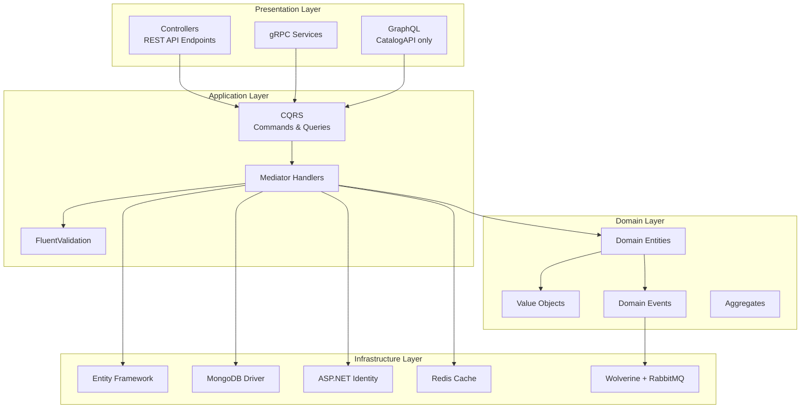
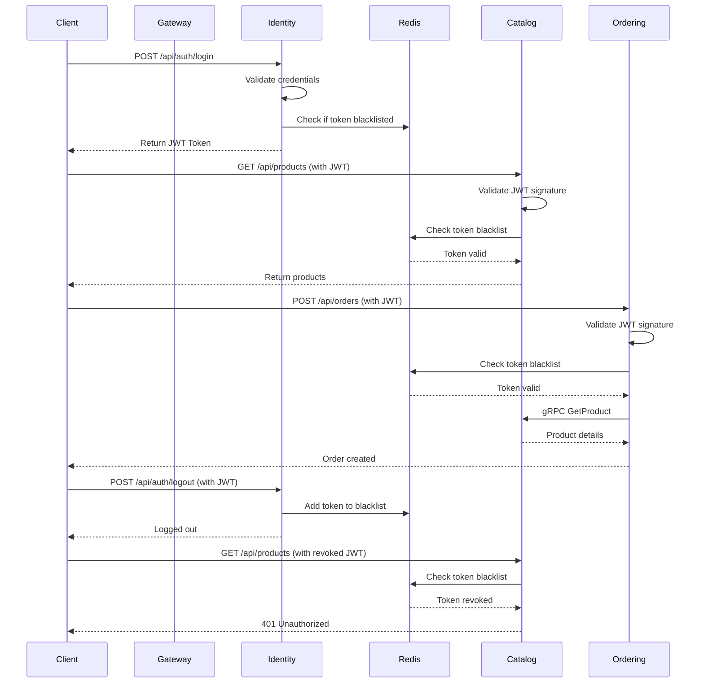
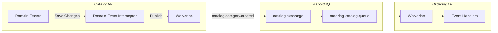
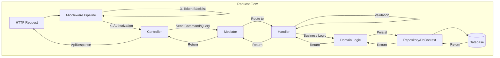
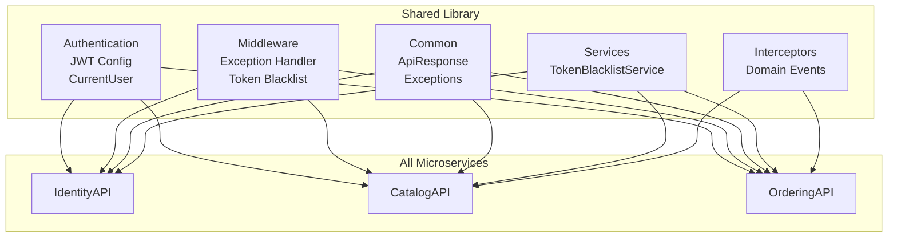
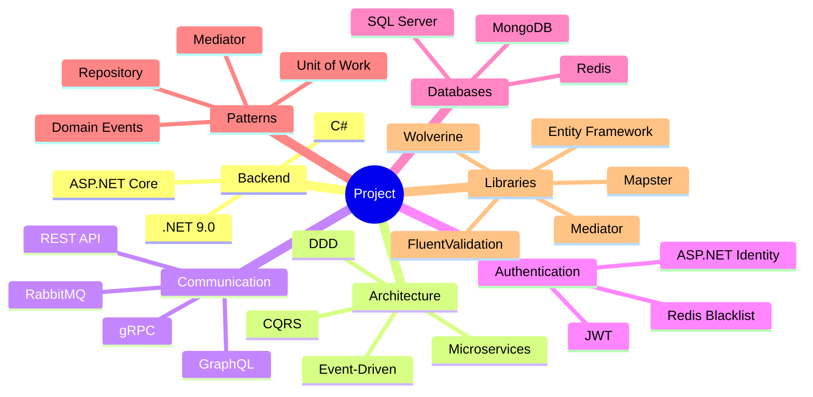

# Project Architecture

## System Overview



## Microservices Architecture



## Clean Architecture Layers



## Authentication & Authorization Flow



## Event-Driven Communication



## Data Flow



## Shared Components



## Technology Stack



## Deployment Architecture

```mermaid
graph TB
    subgraph "Docker Compose"
        subgraph "Services"
            Identity_Container[identity-api:8088/8089]
            Catalog_Container[catalog-api:8080/8081]
            Ordering_Container[ordering-api:8084/8085]
        end
        
        subgraph "Infrastructure"
            SQL_Container[sqlserver:1433]
            Mongo_Container[mongodb:27017]
            Redis_Container[redis:6379]
            Rabbit_Container[rabbitmq:5672/15672]
        end
        
        subgraph "Network"
            Network[microservices-net]
        end
    end

    Identity_Container -.-> Network
    Catalog_Container -.-> Network
    Ordering_Container -.-> Network
    SQL_Container -.-> Network
    Mongo_Container -.-> Network
    Redis_Container -.-> Network
    Rabbit_Container -.-> Network

    Catalog_Container --> SQL_Container
    Ordering_Container --> SQL_Container
    Identity_Container --> Mongo_Container
    Identity_Container --> Redis_Container
    Catalog_Container --> Redis_Container
    Ordering_Container --> Redis_Container
    Catalog_Container --> Rabbit_Container
    Ordering_Container --> Rabbit_Container
```

## Key Features

### IdentityAPI
- User registration & authentication
- JWT token generation
- Token blacklist management
- Role-based authorization
- MongoDB for user storage

### CatalogAPI
- Product & category management
- GraphQL API
- gRPC services for inter-service communication
- Domain events publishing
- SQL Server storage

### OrderingAPI
- Order management
- Event-driven architecture
- gRPC client for product info
- Hybrid caching (Redis + Memory)
- SQL Server storage

### Shared Components
- JWT authentication middleware
- Global exception handler
- Token blacklist service
- API response wrapper
- Domain event interceptor
