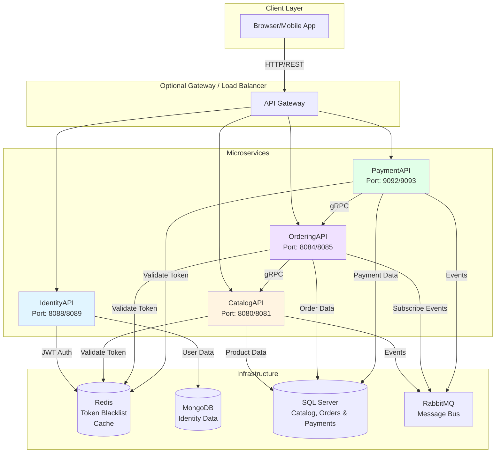
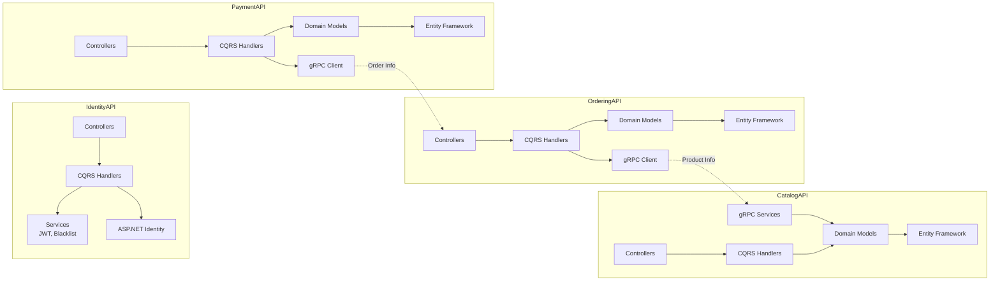
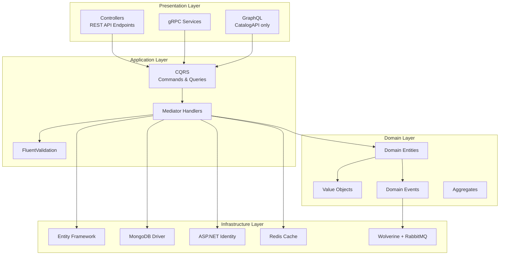
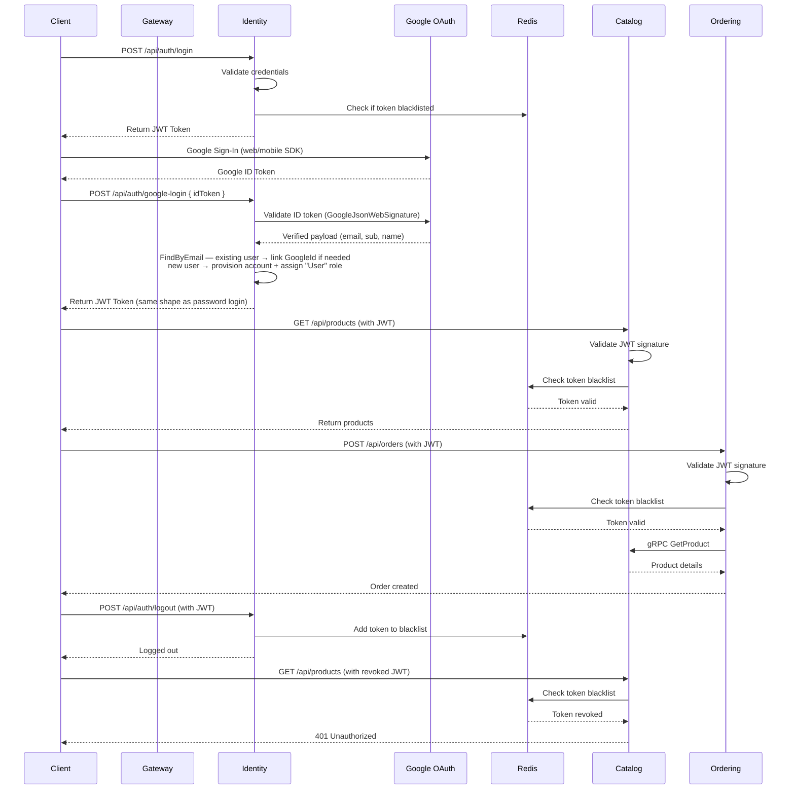
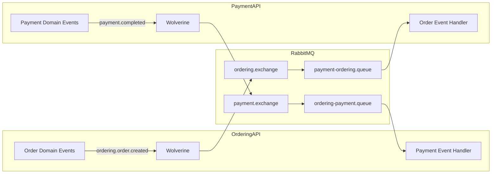
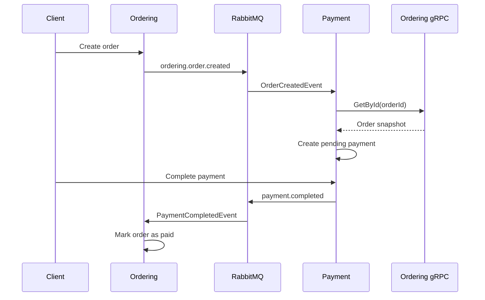
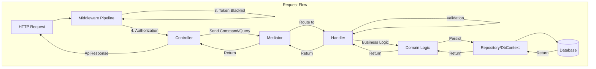
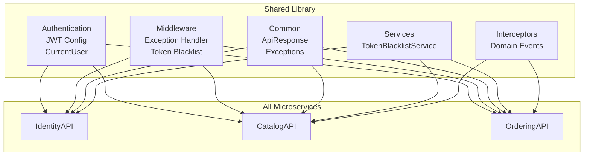
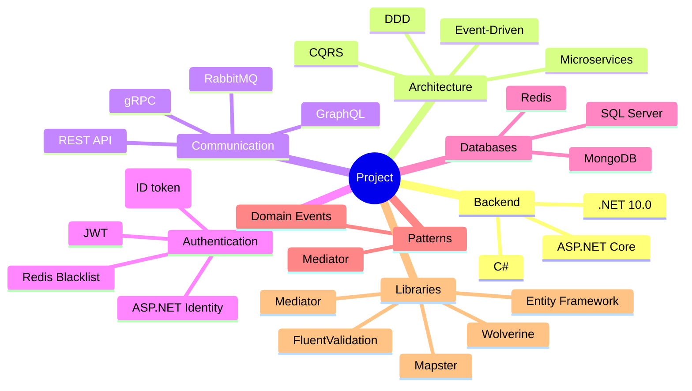

# Project Architecture

## System Overview

This repository currently contains the four backend services and shared libraries shown below. The gateway in the first diagram is conceptual only; there is no API gateway project in this solution today.



## Microservices Architecture



## Service Layering

Each microservice is implemented as a single deployable project with folder-based layering:

- `Controllers`, gRPC services, and GraphQL resolvers form the presentation edge
- `Features` contains CQRS-style commands, queries, handlers, and request models
- `Domain` contains entities, value objects, domain events, EF mappings, and migrations
- `Services` plus `Program.cs` wire infrastructure such as auth, caching, messaging, and database access

This is a pragmatic layered microservice structure rather than a strict multi-assembly Clean Architecture implementation.

## Layered View



## Authentication & Authorization Flow



## Event-Driven Communication



## Payment Flow



## Data Flow



## Shared Components



## Technology Stack



## Deployment Architecture

```mermaid
graph TB
    subgraph "Docker Compose"
        subgraph "Services"
            Identity_Container[identity-api:8088/8089]
            Catalog_Container[catalog-api:8080/8081]
            Ordering_Container[ordering-api:8084/8085]
        end
        
        subgraph "Infrastructure"
            SQL_Container[sqlserver:1433]
            Mongo_Container[mongodb:27017]
            Redis_Container[redis:6379]
            Rabbit_Container[rabbitmq:5672/15672]
        end
        
        subgraph "Network"
            Network[microservices-net]
        end
    end

    Identity_Container -.-> Network
    Catalog_Container -.-> Network
    Ordering_Container -.-> Network
    SQL_Container -.-> Network
    Mongo_Container -.-> Network
    Redis_Container -.-> Network
    Rabbit_Container -.-> Network

    Catalog_Container --> SQL_Container
    Ordering_Container --> SQL_Container
    Identity_Container --> Mongo_Container
    Identity_Container --> Redis_Container
    Catalog_Container --> Redis_Container
    Ordering_Container --> Redis_Container
    Catalog_Container --> Rabbit_Container
    Ordering_Container --> Rabbit_Container
```

## Key Features

### IdentityAPI
- User registration & authentication
- JWT token generation
- Token blacklist management
- Role-based authorization
- MongoDB for user storage
- **Google OAuth login** — server-side ID token validation via `Google.Apis.Auth`; auto-provisions local accounts on first login; links Google identity to existing accounts by verified email

  → See [Google Login](./google-login.md) for full documentation, configuration, and security details.

### CatalogAPI
- Product & category management
- GraphQL API
- gRPC services for inter-service communication
- Domain events publishing
- SQL Server storage

### OrderingAPI
- Order management
- Event-driven architecture
- gRPC client for product info
- Hybrid caching (Redis + Memory)
- SQL Server storage

### Shared Components
- JWT authentication middleware
- Global exception handler
- Token blacklist service
- API response wrapper
- Domain event interceptor
- Shared request validation filter

## Current Gaps

- No dedicated API gateway project is included in this repository
- Service boundaries are still enforced mostly by conventions and folder structure, not separate domain/application/infrastructure assemblies
- Test coverage is present but currently focused on key regression paths rather than full end-to-end scenarios
