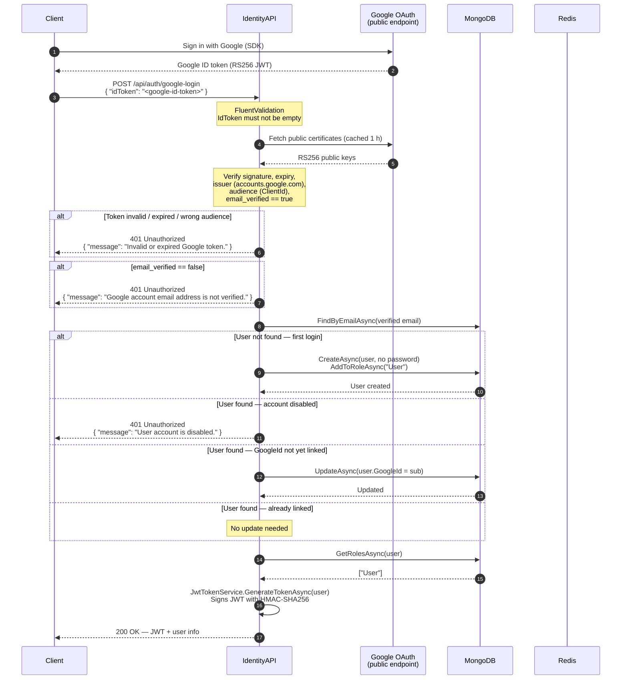

# Google Login

## Overview

IdentityAPI supports Google Sign-In as an alternative authentication method alongside password-based login. Clients obtain a **Google ID token** using the Google Sign-In SDK (web, Android, or iOS), then forward that token to the backend for server-side verification. On success the API issues the same JWT used by all other authentication flows.

---

## Flow Summary

1. Client authenticates with Google using the Google Sign-In SDK and receives a Google **ID token** (a signed JWT issued by Google).
2. Client sends the ID token to `POST /api/auth/google-login`.
3. IdentityAPI validates the ID token **server-side** against Google's public certificates.
4. The verified email from the token payload is used to look up a local account:
   - **Existing account** — the user is signed in. The Google `sub` identifier is linked to the local account on first use.
   - **New account** — a local `ApplicationUser` is provisioned automatically and assigned the `User` role.
5. IdentityAPI issues a signed JWT identical in shape and claims to a standard password login response.
6. The client uses that JWT as a Bearer token for all subsequent API calls.

The issued JWT is subject to the same blacklist check on every request (via `JwtBlacklistMiddleware` + Redis) and the same `[Authorize]` policies as tokens from password login.

---

## Sequence Diagram



---

## Configuration

### Required settings

| Key | Where to set | Description |
|-----|-------------|-------------|
| `Google:ClientId` | Environment variable `Google__ClientId` or secrets manager | OAuth 2.0 Client ID from Google Cloud Console. **Must not be empty** — the application will refuse to start if this is not set. |

> **Never** put the Client ID in committed appsettings files for production. Use environment variables, Azure Key Vault, or another secrets manager.

The Client ID is **not a secret** in the strict sense (it appears in client-side Google Sign-In code), but it must be managed through configuration to keep environment-specific values out of source control.

### appsettings structure

```json
{
  "Google": {
    "ClientId": ""
  }
}
```

For local development, set the value in `appsettings.Development.json` (already gitignored for secrets) or via the .NET user-secrets store:

```bash
dotnet user-secrets set "Google:ClientId" "your-client-id.apps.googleusercontent.com" --project IdentityAPI
```

### Docker / Kubernetes

Pass the value as an environment variable:

```yaml
# docker-compose.yaml
environment:
  - Google__ClientId=your-client-id.apps.googleusercontent.com

# Kubernetes secret + env ref (recommended)
env:
  - name: Google__ClientId
    valueFrom:
      secretKeyRef:
        name: identity-secrets
        key: google-client-id
```

### Google Cloud Console setup

1. Open [Google Cloud Console → APIs & Services → Credentials](https://console.cloud.google.com/apis/credentials).
2. Create an **OAuth 2.0 Client ID** of type **Web application** (or Android/iOS for mobile).
3. Add the authorised JavaScript origins and redirect URIs for your frontend.
4. Copy the Client ID value and provide it via configuration above.

---

## API Reference

### Endpoint

```
POST /api/auth/google-login
```

No authentication required. Rate-limiting at the infrastructure layer is recommended.

### Request

```json
{
  "idToken": "eyJhbGciOiJSUzI1NiIsImtpZCI6Ii4uLiJ9.eyJpc3MiOiJhY2NvdW50cy5nb29nbGUuY29tIiwiYXVkIjoiMTIzNDU2Ljg5MGFiY2QuYXBwcy5nb29nbGV1c2VyY29udGVudC5jb20iLCJzdWIiOiIxMTcwMDEiLCJlbWFpbCI6ImFsaWNlQGV4YW1wbGUuY29tIiwiZW1haWxfdmVyaWZpZWQiOnRydWUsImdpdmVuX25hbWUiOiJBbGljZSIsImZhbWlseV9uYW1lIjoiU21pdGgiLCJleHAiOjk5OTk5OTk5OTl9.signature"
}
```

| Field | Type | Required | Description |
|-------|------|----------|-------------|
| `idToken` | `string` | ✅ | Google ID token obtained from the Google Sign-In SDK |

### Success response — `200 OK`

```json
{
  "success": true,
  "message": "Login successful",
  "data": {
    "token": "eyJhbGciOiJIUzI1NiIsInR5cCI6IkpXVCJ9.eyJ...",
    "expiresAt": "2026-03-18T18:49:30.446Z",
    "user": {
      "id": "3fa85f64-5717-4562-b3fc-2c963f66afa6",
      "username": "alice@example.com",
      "email": "alice@example.com",
      "firstName": "Alice",
      "lastName": "Smith",
      "roles": ["User"]
    }
  },
  "timestamp": "2026-03-18T17:49:30.446Z"
}
```

The response shape is **identical** to `POST /api/auth/login`. Consumers do not need to distinguish between the two login methods.

### Error responses

| HTTP status | When |
|-------------|------|
| `400 Bad Request` | `idToken` is missing or empty (FluentValidation) |
| `401 Unauthorized` | Token signature invalid, expired, wrong audience, issuer mismatch, or `email_verified` is false |
| `401 Unauthorized` | Matching local account exists but is disabled (`IsActive = false`) |
| `400 Bad Request` | Account provisioning failed (e.g. duplicate email race condition) |
| `500 Internal Server Error` | Unexpected failure |

**400 example** (missing token):

```json
{
  "success": false,
  "message": "Validation failed",
  "errors": ["Google ID token is required."],
  "timestamp": "2026-03-18T17:49:30.446Z"
}
```

**401 example** (invalid token):

```json
{
  "success": false,
  "message": "Unauthorized",
  "errors": ["Invalid or expired Google token."],
  "timestamp": "2026-03-18T17:49:30.446Z"
}
```

---

## Account Lifecycle

### First Google login — new user provisioned

When no local account exists for the verified email:

- A new `ApplicationUser` is created with `CreateAsync` (no password hash).
- `Username` is set to the email address (guaranteed unique by `RequireUniqueEmail = true`).
- `FirstName` / `LastName` are populated from Google's `given_name` / `family_name` claims (empty string if not provided by the token scope).
- `EmailConfirmed` is set to `true` — Google has already verified the address.
- `GoogleId` is set to the Google `sub` claim.
- The `User` role is assigned via `AddToRoleAsync`.

Google-provisioned accounts have **no password**. They cannot be used with `POST /api/auth/login`. If a user later wants password login they would need a separate password-reset flow (not currently implemented).

### Subsequent Google logins — existing account

The local account is found by verified email. The `GoogleId` field is set on the first successful match if not already present (one-way link — an existing `GoogleId` is never overwritten).

### Account linking — password account + Google

If a user registered with a password and then signs in with Google using the same email:

- The verified Google email is matched to the existing local account.
- The `GoogleId` is recorded on that account on first match.
- Both login paths remain valid for that account.

**Assumption:** Email is treated as the verified identity anchor. Because Google only issues tokens with `email_verified = true` (enforced server-side), this is safe. Overwriting a different existing `GoogleId` is intentionally blocked — that would require an explicit re-linking flow.

---

## Security Considerations

### What is validated on every call

| Claim | Enforced by |
|-------|-------------|
| Signature (RS256) | `Google.Apis.Auth` — verified against Google's public certificates |
| `exp` (expiry) | `Google.Apis.Auth` |
| `iat` (issued-at, max 30 s skew) | `Google.Apis.Auth` |
| `iss` (must be `accounts.google.com` or `https://accounts.google.com`) | `Google.Apis.Auth` |
| `aud` (must match `Google:ClientId`) | `Google.Apis.Auth` — `null` audience would skip this check; our code always provides the configured ClientId |
| `email_verified == true` | `GoogleTokenValidator` — **not** checked by the SDK; explicit guard added after security review |

### Why `email_verified` matters

Google allows users to sign up with an unverified email address. If `email_verified` were not checked, an attacker could:

1. Create a Google account with an unverified email matching an existing local user's email.
2. Call `POST /api/auth/google-login` with that token.
3. Be matched to the victim's account by email and receive a JWT for it.

The explicit `payload.EmailVerified != true` check closes this.

### What is not trusted from the client

- The email address is taken only from the validated token payload — it is never read from the request body.
- The `sub` (Google user ID), `given_name`, and `family_name` are all sourced from the payload.
- No client-supplied identity fields are used anywhere in the flow.

### Token not logged

The raw `idToken` string is never written to any log sink. `GlobalExceptionHandler` logs the exception object on failure; the SDK's `InvalidJwtException.Message` contains only a description string (e.g. `"JWT is expired."`) — the raw JWT or decoded claim values are not embedded in it.

### Misconfiguration detected at startup

`GoogleSettingsValidator` implements `IValidateOptions<GoogleSettings>` and is registered as a singleton. If `Google:ClientId` is empty or whitespace, the application throws `OptionsValidationException` at startup rather than starting in a broken state where all Google logins silently fail.

### Audience bypass protection

`ValidationSettings.Audience` is set to a single-element collection containing the configured `ClientId`. If the collection were `null` the SDK would skip audience validation entirely — this is why an explicit non-null value is always supplied. An empty `ClientId` is caught by `GoogleSettingsValidator` before the validator is ever invoked.

---

## Implementation Notes

### Layer responsibilities

| Layer | Component | Responsibility |
|-------|-----------|---------------|
| Controller | `AuthController.GoogleLogin` | Receives `GoogleLoginRequest`, delegates to mediator, returns `ApiResponse` |
| Application | `GoogleLoginCommand` / `GoogleLoginHandler` | Orchestrates validation, user lookup, provisioning, JWT issuance |
| Application | `GoogleLoginValidator` | FluentValidation — `IdToken` must not be empty |
| Service | `IGoogleTokenValidator` / `GoogleTokenValidator` | Wraps Google.Apis.Auth SDK; keeps SDK types out of the handler |
| Service | `GoogleSettings` / `GoogleSettingsValidator` | Typed options + startup validation |
| Domain | `ApplicationUser.GoogleId` | Stores the Google `sub` claim for account linking |

The `IGoogleTokenValidator` interface means the handler has no compile-time dependency on `Google.Apis.Auth`. Unit tests mock the interface without pulling in the SDK or making network calls.

### JWT issuance

`IJwtTokenService.GenerateTokenAsync` is called identically to the password login path. The resulting JWT carries the same claims (`sub`, `email`, `name`, `role`) and is subject to the same expiry, blacklist, and validation policies across all services.

### Google certificate caching

`Google.Apis.Auth` caches Google's public certificates in memory and refreshes them approximately once per hour. No explicit cache configuration is needed. This means the first request after startup may be slightly slower (certificate fetch), but subsequent requests use the in-memory cache.

---

## Known Limitations

| Limitation | Notes |
|-----------|-------|
| No password for Google-provisioned accounts | Users who sign up via Google cannot log in with a password. A password-reset / account-merge flow is not currently implemented. |
| No re-linking UX | An existing `GoogleId` is never overwritten. Changing the linked Google account requires a manual data change. |
| No hosted domain (`hd`) restriction | Any Google account with a verified email can sign up. If restriction to a specific Google Workspace domain is needed, add a `HostedDomain` check against `payload.HostedDomain`. |
| No scope enforcement | The handler only uses claims available in the basic `openid email profile` scope. If the client requests additional scopes, those claims are ignored. |
| Certificate fetch is blocking on first use | Cold-start latency is slightly higher on the first Google login. This is inherent to `Google.Apis.Auth` and acceptable for most deployments. |
