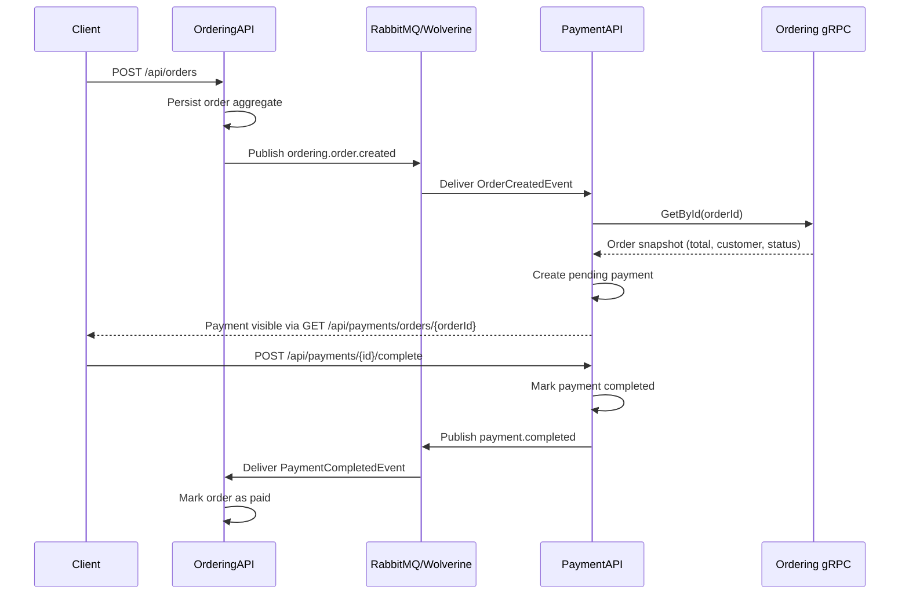

# PaymentAPI Technical Design

## Overview

`PaymentAPI` is a new bounded context responsible for the payment lifecycle for orders. It follows the same pragmatic DDD/CQRS structure already used in the solution:

- `Controllers` expose REST endpoints and OpenAPI metadata
- `Features` contains Mediator commands, queries, validators, and integration handlers
- `Domain` contains the payment aggregate, domain events, EF mappings, and migrations
- `Services` contains infrastructure adapters such as the Ordering gRPC client

The service persists payments in SQL Server, publishes integration events through Wolverine + RabbitMQ, and uses gRPC to read order data from `OrderingAPI`.

## Payment lifecycle

## Domain model

`Payment` is the aggregate root. It owns:

- `OrderId`
- `Amount` as a `Money` value object
- `Status` (`Pending`, `Completed`, `Failed`)
- `TransactionReference`
- `FailureReason`
- `CompletedAtUtc`

Domain events emitted by the aggregate:

- `PaymentCreatedDomainEvent`
- `PaymentCompletedDomainEvent`
- `PaymentFailedDomainEvent`

These are translated into integration events using Wolverine:

- `payment.created`
- `payment.completed`
- `payment.failed`

## REST endpoints

`PaymentAPI` exposes the following endpoints through OpenAPI/Swagger:

- `GET /api/payments`
- `GET /api/payments/{id}`
- `GET /api/payments/orders/{orderId}`
- `POST /api/payments/{id}/complete`
- `POST /api/payments/{id}/fail`

Request validation is enforced with FluentValidation for payment completion and failure requests.

## Internal communication

`PaymentAPI` does not read the Orders database directly. For internal reads it uses gRPC exclusively:

- `OrderCreatedEvent` supplies the order identifier
- `PaymentAPI` then calls `OrderingAPI` `OrderSvc.GetById` to read the order snapshot

This keeps service boundaries explicit and avoids coupling the payment model to Ordering persistence.

## Consistency implications

This flow is **eventually consistent**, not strongly consistent.

Implications:

- after an order is created, a payment record may appear shortly after the HTTP response, not atomically in the same transaction
- after a payment is completed, the order status may remain `Submitted` briefly until `OrderingAPI` consumes `payment.completed`
- duplicate messages are tolerated through idempotent checks:
  - `PaymentAPI` ignores duplicate `OrderCreatedEvent` messages when a payment already exists for the order
  - `OrderingAPI` ignores duplicate `PaymentCompletedEvent` messages when the order is already paid

Operationally, this is safer than cross-service distributed transactions and aligns with the repository's event-driven architecture.

## Configuration

Important configuration keys:

- `ConnectionStrings:Default`
- `ConnectionStrings:Redis`
- Aspire gRPC service discovery via `http://_grpc.ordering-api` when running under AppHost, with `GrpcServices:Ordering` retained as the explicit fallback for non-Aspire environments
- `RabbitMq:*`
- `Wolverine:OrderingExchange`
- `Wolverine:PaymentExchange`
- `Wolverine:PaymentOrderingQueue`
- `Wolverine:LocalQueue`

## Testing scope

Automated coverage added for:

- payment completion happy path and failure path
- not-found and invalid-state command handling
- validators for payment completion/failure requests
- `OrderCreatedEvent` -> pending payment creation with mocked gRPC dependency
- idempotent duplicate event handling
- `payment.completed` -> order paid integration handling
- routing-key regression for `OrderCreatedEvent`

## Remaining gaps

Current gaps that remain reasonable for a first vertical slice:

- controller-level tests for `PaymentAPI`
- end-to-end cross-process messaging tests with RabbitMQ
- gRPC server endpoints for `PaymentAPI` itself if another service later needs payment reads
